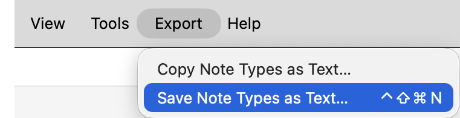
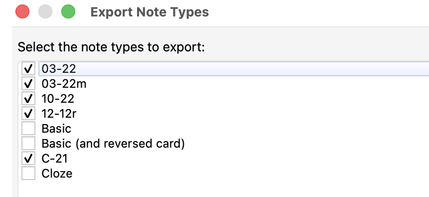

# Export Note Types as Text

Anki note types define much of the structure and behavior of a collection — which fields a note contains, which field is used for sorting, which card types are defined, under what conditions cards are generated, and how those cards are rendered. In larger or more specialized collections, these definitions often encode conventions that are difficult to reconstruct from individual notes alone.

This add-on exports selected note types as structured Markdown for inspection by the user or an LLM. The export is intended to capture the aspects of the selected note-type and card-type definitions that matter most for understanding their structure and behavior, without attempting to serialize the whole collection or reproduce every rendering detail.

**Export Note Types as Text** is designed to complement **[Export Deck Tree as Text](https://github.com/schmidhauser/anki-export-deck-tree-as-text)**, **[Export Field and Tag Legend as Text](https://github.com/schmidhauser/anki-export-field-tag-legend-as-text)**, **[Export Tags as Text](https://github.com/schmidhauser/anki-export-tags-as-text)**, and, in the Browser, **[Export Selected Notes to Structured Text](https://github.com/schmidhauser/anki-export-selected-notes-to-structured-text)**. Used together, these add-ons provide an LLM with the collection’s deck structure, note-type structure, field and tag conventions, tag inventory, and selected notes for assessment or as concrete exemplars.

## Installation

Install **Export Note Types as Text** from [AnkiWeb](https://ankiweb.net/shared/info/1033830704) using add-on code `1033830704`.

## Usage



Choose either of the following menu items:

* **Export → Copy Note Types as Text…**
* **Export → Save Note Types as Text…**

Both commands open the same selection dialog. Select the note types to export, then choose **OK**.



**Copy Note Types as Text…** places the resulting Markdown on the clipboard. **Save Note Types as Text…** writes it to a UTF-8 Markdown file, by default named `anki-note-types-YYYY-MM-DD.md`.

The add-on only reads note-type definitions; it does not modify the collection.

## Configuration

The initial note-type selection and keyboard shortcuts can be changed in the add-on’s configuration dialog:

**Tools → Add-ons → 𝕾 Export Note Types as Text → Config**

By default, all note types are selected. **Copy Note Types as Text…** has no assigned shortcut, whereas **Save Note Types as Text…** uses `Meta+Ctrl+Shift+N` (`⌃⇧⌘N`). One can also specify note types that should be unchecked when the **Export Note Types** dialog opens; they can still be selected manually for any individual export.

## Format

The export is deterministic Markdown intended to be readable both by humans and by LLMs.

It begins with a summary giving the number and names of the exported note types. For each note type, it then records:

* note-type name and kind;
* sort field;
* fields in their Anki display order;
* card-generation requirements expressed in terms of field names;
* card types in their stored order;
* front and back templates.

An example:

````markdown
# ANKI NOTE TYPES

Exported note types (1): `Basic`.

## Basic

- kind: standard
- sort field: `Front`

### Fields

1. `Front`
2. `Back`

### Card-generation requirements

- Card 1 (`Card 1`) requires any non-empty field among: `Front`

### Card types

#### Card 1: Card 1

Front template:

```html
{{Front}}
```

Back template:

```html
{{FrontSide}}

<hr id=answer>

{{Back}}
```
````

Note types are sorted case-insensitively by name. Field and card-type order is preserved.

HTML comments are removed from front and back templates before export; otherwise the template text is preserved. This prevents large hidden comments, such as embedded collection documentation, from being included in the note-type export.

The note type’s Styling, Browser Appearance, deck overrides, LaTeX configuration, internal IDs, and similar metadata are intentionally omitted because they are usually less relevant to assessing or creating notes and would substantially increase the size of the export. External resources referenced by templates, such as CSS or JavaScript files, are likewise not embedded. These choices may be revisited in future versions if there is a clear use case for exporting additional note-type metadata.

## Compatibility

Tested with Anki 26.08 on macOS Tahoe 26. Windows and Linux have not yet been tested.

## Version

Version 1.0.

## Feedback

Suggestions and bug reports are welcome. Please [open an issue on GitHub](https://github.com/schmidhauser/anki-export-note-types-as-text/issues).

## License

Licensed under the [GNU AGPL v3 or later](LICENSE).
